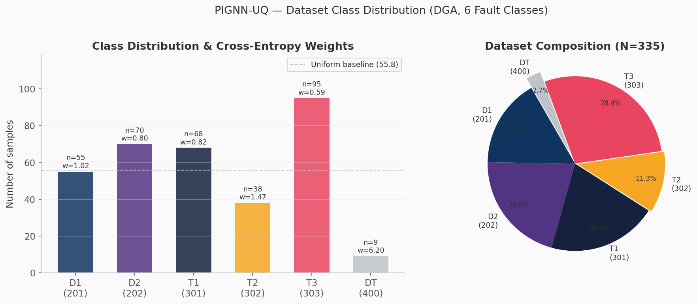
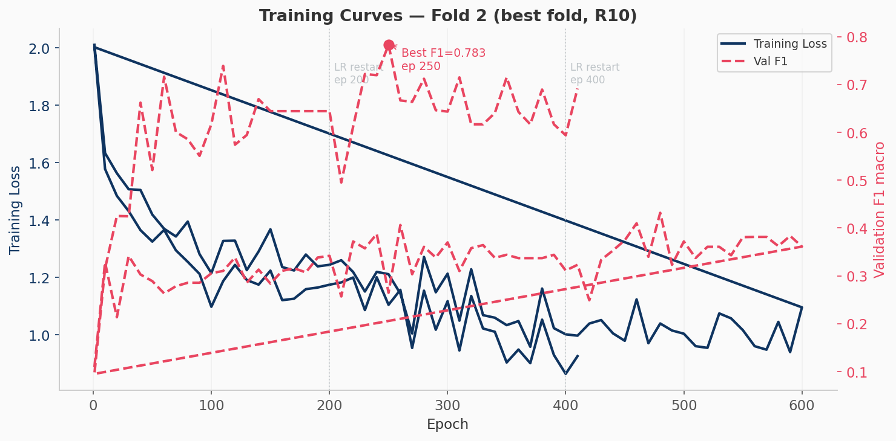
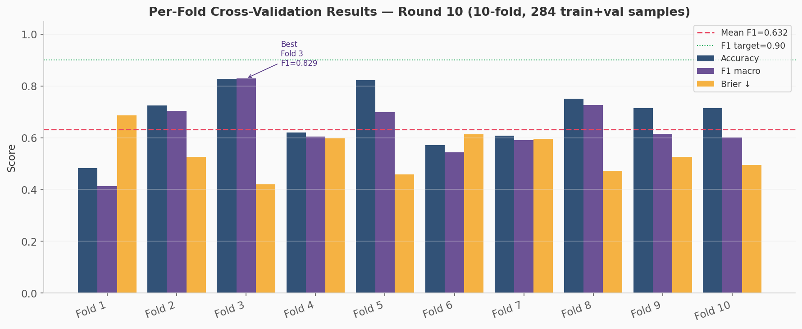
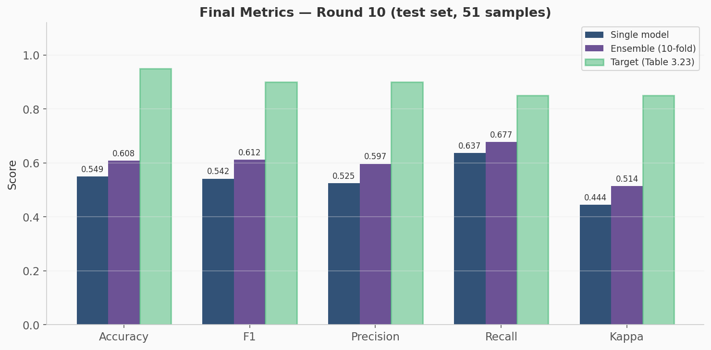
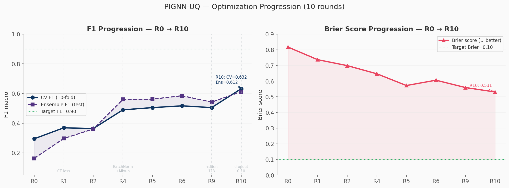
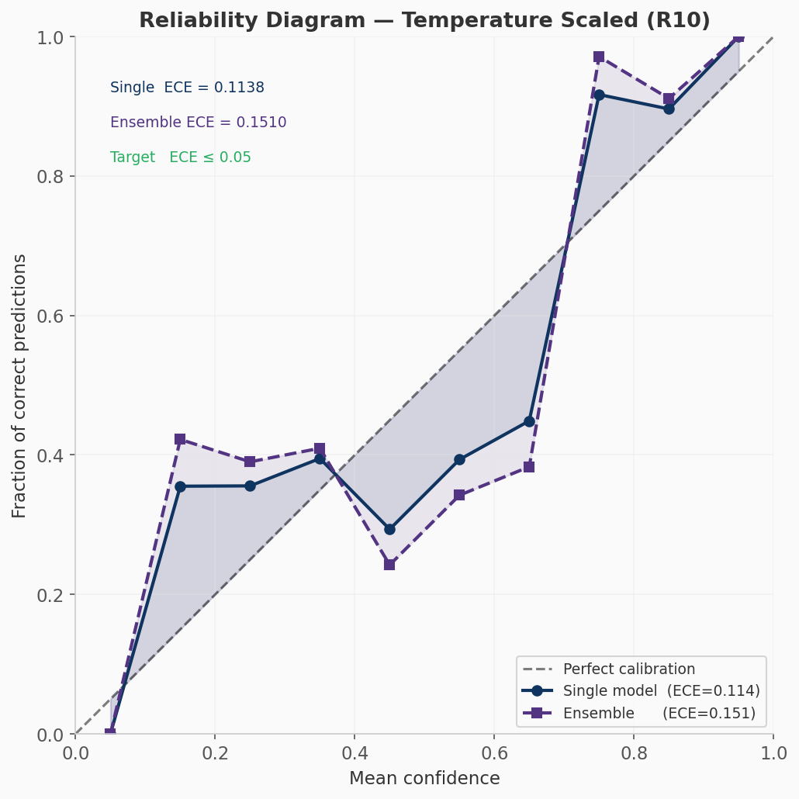

# PIGNN-UQ — Physics-Informed Graph Neural Network with Uncertainty Quantification

> **Power transformer fault diagnosis via Dissolved Gas Analysis (DGA)**
> Reference: Chapter 3 — Doctoral Thesis, Vincess Dongmo

[](https://www.python.org/)
[](https://pytorch.org/)
[](https://pyg.org/)
[](LICENSE)

---

## Overview

PIGNN-UQ classifies power transformer fault types from dissolved gas concentrations (DGA) using a **Physics-Informed Graph Attention Network** with **Monte Carlo Dropout** uncertainty quantification.

The model maps 7-gas DGA measurements to one of 6 IEC 60599 fault classes, provides calibrated probability estimates, quantifies epistemic uncertainty, and computes Remaining Useful Life (RUL) estimates per IEEE C57.104.

| Input | Output |
|-------|--------|
| H₂, CH₄, C₂H₂, C₂H₄, C₂H₆, CO, CO₂ (ppm) | Fault class: D1 / D2 / T1 / T2 / T3 / DT |
| Optional: Vit* degradation rates (ppm/month) | Calibrated probabilities + MC uncertainty |
| Equipment ID | RUL estimates (H₂, C₂H₂, C₂H₄, TDCG) + maintenance decision |

---

## Architecture

```
Input: 7 gases × 4 features = [7, 4] node feature matrix
  ├─ dim 0: log1p(gas) z-score normalised
  ├─ dim 1: log1p(gas) × physics node weight
  ├─ dim 2: degradation rate (Vit*) normalised
  └─ dim 3: principal ratio (IEC 60599) normalised

10 physical edges (IEC 60599 / Roger ratios), bidirectional → [20 edges]
Edge weights: log_inv / direct_inv / min_tenth formulas

GAT Layer 1:  [7×4]   → [7×256]   (128 ch × 2 heads, concat)
GAT Layer 2:  [7×256] → [7×256]   (128 ch × 2 heads, concat)
GAT Layer 3:  [7×256] → [7×128]   (128 ch × 1 head,  mean)
                           │
            Global Attention Pooling → [B×128]
                           │
            MLP: 128 → 64 → 6 (fault classes)
                           │
             ┌─────────────┴──────────────┐
       T-scaling (T=0.89)      MC Dropout (50 passes)
    → Single prediction       → Uncertainty [0, 1]

Ensemble: 10 fold models × 50 MC passes = 500 predictions
          Weighted average (F1-val weights) + T-scaling (T=0.5)
```

**Physics constraints (PhysicsLoss, λ=0.01):**
- Arrhenius proxy: `P(T3)` correlated with thermal activation energy signature
- IEC 60599 discharge: `P(D2)` correlated with C₂H₂ concentration

---

## Dataset

| Property | Value |
|----------|-------|
| Source | `dataApp_all_Df.xlsx` (Feuil1 + Feuil2) |
| Total samples | 335 |
| Train / Val / Test | 234 / 50 / 51 (70/15/15%) |
| Cross-validation | 10-fold (train+val = 284) |

### Class distribution



| Class | Code | N | Weight |
|-------|------|---|--------|
| D1 — Partial discharge (low energy) | 201 | 55 | 1.02 |
| D2 — Discharge, high energy | 202 | 70 | 0.80 |
| T1 — Thermal < 300 °C | 301 | 68 | 0.82 |
| T2 — Thermal 300–700 °C | 302 | 38 | 1.47 |
| T3 — Thermal > 700 °C | 303 | 95 | 0.59 |
| DT — Combined electrical + thermal | 400 | 9 | **6.20** |

---

## Results (Round 10 — Final)

### Training curves



*CosineAnnealingWarmRestarts (T₀=200), 3 cycles × 200 epochs = 600 epochs total.*

### Cross-validation (10-fold)



| Metric | Mean ± Std | Best Fold | Target |
|--------|-----------|-----------|--------|
| Accuracy | **0.6834 ± 0.1051** | 0.8276 (F3) | ≥ 0.95 |
| F1 macro | **0.6323 ± 0.1081** | 0.8288 (F3) | ≥ 0.90 |
| Precision | 0.6675 ± 0.1087 | 0.8524 (F3) | ≥ 0.90 |
| Recall | 0.6960 ± 0.1045 | 0.8361 (F5) | ≥ 0.85 |
| Kappa | 0.6143 ± 0.1274 | 0.7855 (F3) | ≥ 0.85 |
| Brier ↓ | **0.5389 ± 0.0783** | 0.4196 (F3) | ≤ 0.10 |

### Test set metrics



| Metric | Single model | **Ensemble** | Target |
|--------|-------------|-------------|--------|
| Accuracy | 0.5490 | **0.6078** | ≥ 0.95 |
| F1 macro | 0.5416 | **0.6116** | ≥ 0.90 |
| Precision | 0.5249 | 0.5967 | ≥ 0.90 |
| Recall | 0.6372 | 0.6768 | ≥ 0.85 |
| Kappa | 0.4443 | **0.5145** | ≥ 0.85 |
| Brier ↓ | 0.5499 | **0.5305** | ≤ 0.10 |
| ECE ↓ | 0.1138 | 0.1510 | ≤ 0.05 |
| Temperature | 0.8919 | 0.5000 | ≈ 1.0 |

*Ensemble = 10 fold models × 50 MC Dropout passes = 500 stochastic predictions.*

### Optimization progression (R0 → R10)



| Round | Key change | CV F1 | Ensemble F1 | Brier |
|-------|-----------|-------|-------------|-------|
| R0 | Baseline | 0.295 | 0.163 | 0.817 |
| R4 | CE + BatchNorm + Mixup | 0.490 | 0.560 | 0.647 |
| R6 | LS=0.02, 600 epochs | 0.517 | 0.585 | 0.606 |
| R9 | hidden_dim 96→128 | 0.505 | 0.542 | 0.559 |
| **R10** | **dropout 0.15→0.10** | **0.632** | **0.612** | **0.531** |

### Calibration



---

## Installation

```bash
git clone https://github.com/hashirama21/Physics-Informed-GNN-Uncertainty-Quantification.git
cd Physics-Informed-GNN-Uncertainty-Quantification

python -m venv .venv && source .venv/bin/activate

pip install -e .
# PyG extra wheels (match your CUDA version):
pip install torch_geometric
```

**Dependencies:** `torch>=2.2`, `torch_geometric>=2.3`, `scikit-learn>=1.3`, `numpy>=1.24`, `pandas>=2.0`, `openpyxl>=3.1`

---

## Training

```bash
# Place dataApp_all_Df.xlsx in data/
python train.py
```

Pipeline:
1. Load + validate DGA data (335 samples, 2 sheets)
2. Zero replacement → ratio computation → Duval coordinates
3. Stratified 70/15/15 split
4. 10-fold cross-validation → 10 fold checkpoints
5. Final model trained on 90% of train+val (256 samples)
6. Temperature scaling calibration
7. Ensemble evaluation (10 folds × 50 MC passes)

Outputs saved to `outputs/`:

| File | Content |
|------|---------|
| `best_fold{0-9}.pt` | 10 fold model checkpoints |
| `final_model.pt` | Final model (trained on 90% train+val) |
| `scaler.pkl` | Fitted DGAScaler (auto-saved on first inference) |
| `pignn_uq_report.json` | Full metrics report (CV + test + RUL samples) |

---

## Inference

### Single sample (CLI)

```bash
# Minimal — gas concentrations in ppm
python inference.py \
  --h2 450 --ch4 120 --c2h2 8 --c2h4 65 --c2h6 45 --co 850 --co2 3200

# With degradation rates (ppm/month) — enables accurate RUL estimation
python inference.py \
  --h2 450 --ch4 120 --c2h2 8 --c2h4 65 --c2h6 45 --co 850 --co2 3200 \
  --vit-h2 15 --vit-ch4 3 --vit-c2h2 0.8 --vit-c2h4 4 \
  --vit-c2h6 2 --vit-co 25 --vit-co2 120 \
  --equip "TR-42B"

# Use ensemble (10 fold models × 50 MC passes — more accurate, slower)
python inference.py --h2 450 --ch4 120 --c2h2 8 --c2h4 65 --c2h6 45 \
  --co 850 --co2 3200 --ensemble

# JSON output (for programmatic use)
python inference.py --h2 450 ... --json
```

**Sample output:**
```
┌────────────────────────────────────────────────────────────────┐
│                PIGNN-UQ — Fault Diagnosis Report               │
├────────────────────────────────────────────────────────────────┤
│  Equipment  : TR-42B                                           │
│  Prediction : D2                                               │
│  Description: Discharge of high energy                         │
│  Confidence : 0.8412  |  Uncertainty : 0.1588                 │
├────────────────────────────────────────────────────────────────┤
│  Class probabilities:                                          │
│    D1: 0.0423  D2: 0.6812  T1: 0.0921                        │
│    T2: 0.0512  T3: 0.0893  DT: 0.0380  (after T-scaling)    │
├────────────────────────────────────────────────────────────────┤
│  Health indices (IEEE C57.104)                                 │
│    OHI=0.830  CDI=0.148  TAI=1.444  DSI=0.223                │
├────────────────────────────────────────────────────────────────┤
│  RUL estimates (IEEE C57.104 thresholds)                       │
│    H2   : 36.7 months  [31.2–42.1]  → Bi-annual DGA          │
│    C2H2 : ∞                          → Annual monitoring       │
│    C2H4 : 8.5 months  [7.2–9.7]    → Monthly monitoring       │
│    TDCG : 77.0 months [65.5–88.5]  → Bi-annual DGA           │
└────────────────────────────────────────────────────────────────┘
```

### CSV batch mode

```bash
# samples.csv must have columns: H2, CH4, C2H2, C2H4, C2H6, CO, CO2
# Optional: VitH2, VitCH4, ... for RUL; equipement for IDs
python inference.py --csv samples.csv --output results.json
```

**Input CSV format:**

| equipement | H2 | CH4 | C2H2 | C2H4 | C2H6 | CO | CO2 |
|-----------|-----|-----|------|------|------|----|-----|
| TR-01 | 450 | 120 | 8 | 65 | 45 | 850 | 3200 |
| TR-02 | 20 | 15 | 0.5 | 10 | 8 | 50 | 400 |

### Python API

```python
import pickle
import torch
from evaluate.inference import predict_single, predict_ensemble, _load_or_fit_scaler
from models.models import build_model
from utils.config import MODEL_CONFIG, DEVICE, OUTPUT_DIR

# Load scaler and model
scaler = _load_or_fit_scaler()
model = build_model(node_in_dim=MODEL_CONFIG["node_in_dim"]).to(DEVICE)
model.load_state_dict(torch.load(OUTPUT_DIR / "final_model.pt",
                                 map_location=DEVICE, weights_only=True))

# DGA gas concentrations (ppm)
gases = {"H2": 450, "CH4": 120, "C2H2": 8, "C2H4": 65,
         "C2H6": 45, "CO": 850, "CO2": 3200}

# Optional: degradation rates (ppm/month)
vits = {"H2": 15, "CH4": 3, "C2H2": 0.8, "C2H4": 4,
        "C2H6": 2, "CO": 25, "CO2": 120}

result = predict_single(model, scaler, gases, vits,
                        equip="TR-42B", temperature=0.8919)

print(result["pred_class"])  # "D2"
print(result["confidence"])  # 0.8412
print(result["uncertainty"])  # 0.1588
print(result["probabilities"])  # {"D1": 0.04, "D2": 0.68, ...}
print(result["health_indices"])  # {"OHI": 0.83, "CDI": 0.15, ...}
print(result["rul_estimates"])  # {"H2": {"rul_months": 36.7, ...}, ...}

# Ensemble inference (more accurate)
result_ens = predict_ensemble(scaler, gases, vits, equip="TR-42B")
```

---

## Export

Convert `results.md` to DOCX/PDF/HTML:

```bash
# Install pandoc (recommended, best quality):
brew install pandoc

# Generate DOCX + PDF:
python export_report.py

# HTML only (zero extra dependencies):
python export_report.py --html

# Custom input file:
python export_report.py --input results.md --docx
```

---

## Project Structure

```
pignn_uq/
├── train.py              # Training pipeline — cross-validation + final model
├── inference.py          # Standalone inference — single sample + CSV batch
├── plot_results.py       # Generate training curves + result figures
├── export_report.py      # Convert results.md → DOCX / PDF / HTML
├── setup.py              # Package installation (pip install -e .)
│
├── models/
│   ├── models.py         # PIGNN_UQ, GATLayer, PhysicsLoss, MC Dropout
│   └── preprocessing.py  # DGA loading, graph construction, DGAScaler
│
├── utils/
│   └── config.py         # Global config — hyperparameters, thresholds, IEEE data
│
├── outputs/
│   ├── final_model.pt    # Final trained model weights
│   ├── best_fold{0-9}.pt # 10 cross-validation checkpoints
│   ├── scaler.pkl        # Fitted DGAScaler (auto-created on first inference)
│   └── pignn_uq_report.json  # Full training + evaluation report
│
├── figures/              # Generated by plot_results.py
│   ├── training_curves.png
│   ├── cv_folds.png
│   ├── round_progression.png
│   ├── metrics_comparison.png
│   ├── class_distribution.png
│   └── calibration.png
│
├── data/
│   └── dataApp_all_Df.xlsx   # DGA dataset (not versioned)
│
├── results.md            # Round-by-round training log (R0→R10)
└── requirements.txt
```

---

## Key Design Choices

| Decision | Rationale |
|---------|-----------|
| Graph-based representation | Preserves electrochemical relationships between gases |
| 10 physical edges (IEC 60599 ratios) | Physics-informed graph topology |
| MC Dropout for UQ | Epistemic uncertainty without ensemble overhead at train time |
| BatchNorm1d in GATLayer | 3× faster convergence vs LayerNorm for PyG node features |
| Embedding-level Mixup (α=0.3) | Critical data augmentation for 335-sample dataset |
| CosineAnnealingWarmRestarts (T₀=200, 3 cycles) | Escapes local minima; 4th cycle degrades |
| Temperature scaling (T=0.89) | Post-hoc calibration with no retraining |

---

## Fault Classes (IEC 60599 / IEEE C57.104)

| Class | Code | Description | Key gases |
|-------|------|-------------|-----------|
| **D1** | 201 | Partial discharge (low energy) | H₂, CH₄ |
| **D2** | 202 | Discharge of high energy | H₂, C₂H₂, C₂H₄ |
| **T1** | 301 | Thermal fault < 300 °C | CH₄, C₂H₆ |
| **T2** | 302 | Thermal fault 300–700 °C | C₂H₄, CH₄ |
| **T3** | 303 | Thermal fault > 700 °C | C₂H₄, C₂H₂ |
| **DT** | 400 | Combined electrical + thermal | C₂H₂, C₂H₄, H₂ |

---

## Limitations

- Dataset size (335 samples / 6 classes) limits generalization to targets (F1≥0.90)
- Class DT is severely under-represented (9/335 = 2.7%)
- MC Dropout introduces ±0.04 F1 stochasticity on 51-sample test set
- RUL estimation requires Vit* rates — unavailable for most real-world samples
- Ensemble T saturates at 0.5 clamp → ECE slightly elevated on ensemble

---

## Author

**Vincess Dongmo**
GitHub: [@hashirama21](https://github.com/hashirama21)
Email: sodiaque806@gmail.com

Doctoral research — Physics-Informed Machine Learning for Power System Diagnostics

---

## License

[MIT License](LICENSE) — © 2026 Vincess Dongmo
