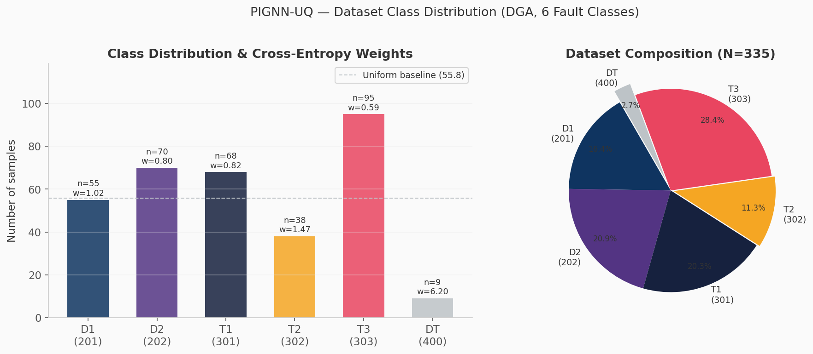

# KG-GNN — Kinetic-Gated Graph Neural Network for Transformer Fault Diagnosis

> **Power transformer fault diagnosis via Dissolved Gas Analysis (DGA)**
> Embedding Arrhenius pyrolysis kinetics into graph topology for physically consistent diagnosis.
> Reference: Doctoral Thesis, Vincess Dongmo, Maguepo Viridiane

[](https://www.python.org/)
[](https://pytorch.org/)
[](LICENSE)

---

## Overview

This repository contains two generations of physics-informed graph models for DGA-based fault classification (7 gas concentrations → 6 IEC 60599 fault classes):

| Model | Idea | Status |
|-------|------|--------|
| **KG-GNN** (`models/kg_gnn.py`, `models/kinetics.py`, `train_kg.py`) | Graph topology **written by the chemistry**: nodes are chemical species, directed edges are pyrolysis reaction channels, each modulated by a differentiable **Arrhenius gate** driven by a latent hot-spot temperature | **Current** |
| PIGNN-UQ (`models/models.py`, `train.py`) | GAT over gas nodes with IEC-ratio edges + MC Dropout UQ | Baseline (v1) |

| Input | Output |
|-------|--------|
| H₂, CH₄, C₂H₂, C₂H₄, C₂H₆, CO, CO₂ (ppm) | Fault class: D1 / D2 / T1 / T2 / T3 / DT |
| Optional: Vit* degradation rates (ppm/month) | Calibrated probabilities + entropy / mutual-information uncertainty |
| | Inferred hot-spot temperature + kinetic gate map (explanation) |

---

## KG-GNN Architecture

```
DGA sample x [7 gases × 4 features]
        │
        ├──────────────► Temperature encoder g_φ(x) → T ∈ [298, 1500] K
        │                                             │
        ▼                                             ▼
Reaction digraph G_chem (9 nodes)        Arrhenius gates κ_ij(T) ∈ (0, 1]
  Oil → H2, CH4, C2H6                    log κ = log½ + (Ea/R)(1/T_half − 1/T)
  C2H6 → C2H4 → C2H2  (arc channel)      Ea anchored to pyrolysis literature,
  CH4 → C2H6                             T_half = IEC 60599 regime boundary
  Cell → CO, CO2
        │
        ▼
3 × kinetic-gated message passing:  m_i = Σ κ_ji(T) · α_ji · W h_j
        │        (a closed channel transmits nothing, whatever attention prefers)
        ▼
Attention pooling over gas nodes → MLP → 6 fault classes
        + by-products: T, gate map  (explanation *is* the computation)
```

**Training objective**

```
L = L_CE + λ_phys·L_phys + λ_obs·L_obs + λ_T·L_T + λ_ea·Ω(Ea)
```

- `L_phys` — probability mass on a class whose required kinetic pathway is **closed** at the inferred T is penalised (pathway sets: D2/DT require the acetylene channel, T2/T3 the ethylene channel, …).
- `L_obs` — the dual term: a gate **open** toward a gas measured near-absent is penalised. Together they force the encoder to infer the *lowest hot-spot temperature consistent with the observed signature* (maximum-parsimony principle) and prevent the trivial optimum T → T_max.
- `L_T` — weak quadratic hinge keeping the latent T of the true class inside its IEC 60599 regime bounds (train-time only).
- `Ω(Ea)` — elastic penalty confining learned activation energies to their published intervals, so gates keep their kJ/mol interpretation.

Defaults (selected on validation only): `λ_phys=0.1, λ_obs=0.2, λ_T=0.3, λ_ea=1.0`.

**Metrics beyond accuracy**

- **PCR** (Physical Consistency Rate): fraction of predictions whose required pathways are open at the inferred T.
- **Gate AUROC**: κ(C₂H₄→C₂H₂) as binary detector — reported both for discharge classes (D2/DT) and for the high-energy regime (D2/T3/DT, what the gate physically encodes; T3 legitimately opens it).
- Per-class inferred-T distribution (physics sanity check), predictive entropy + BALD mutual information, ECE, Brier.

---

## Dataset

| Property | Value |
|----------|-------|
| Source | `data/dataApp_all_Df.xlsx` (Feuil1 + Feuil2) |
| Total samples | 335 |
| Classes | D1 (55) · D2 (70) · T1 (68) · T2 (38) · T3 (95) · DT (9) |



---

## Preliminary results (single stratified split — repeated 5×5 CV in progress)

Test set (51 samples), MC Dropout 50 passes, temperature scaling fitted on validation:

| Metric | PIGNN-UQ ensemble (10×50) | **KG-GNN (single model)** |
|--------|--------------------------|---------------------------|
| Macro-F1 | 0.612 | **0.827** |
| Accuracy | 0.608 | **0.824** |
| Kappa | 0.515 | **0.778** |
| Brier ↓ | 0.531 | **0.267** |
| ECE ↓ | 0.151 | **0.086** |
| Inference (CPU) | ~141 ms/sample | **4.1 ms/sample (34×)** |

With the parsimony terms (`L_obs`, `L_T`), the per-class inferred temperatures spread physically (T1 ≈ 560 K < D1 ≈ 730 K < D2 ≈ 895 K < T2 ≈ 945 K < DT/T3 > 1000 K) and the acetylene-gate AUROC for the high-energy regime reaches ≈ 0.92.

> ⚠️ Single-split numbers on a 51-sample test set: treat as indicative. The frozen evaluation protocol is repeated stratified 5-fold × 5 CV (`--cv-folds 5 --cv-repeats 5`); results will replace this table. The PIGNN-UQ column comes from the v1 pipeline on the same split and has not yet been re-run under the CV protocol.

Baseline (v1) training curves and round-progression figures: see `figures/` and `results.md`.

---

## Installation

```bash
git clone https://github.com/hashirama21/Physics-Informed-GNN-Uncertainty-Quantification.git
cd Physics-Informed-GNN-Uncertainty-Quantification

python -m venv .venv && source .venv/bin/activate
pip install torch torch_geometric scikit-learn pandas openpyxl
```

`torch_geometric` is used by the preprocessing pipeline only; the KG-GNN model itself is dense (9-node graph) and PyG-free.

---

## Training

```bash
# KG-GNN — single stratified split (fast check)
python train_kg.py

# Paper protocol: repeated stratified k-fold
python train_kg.py --cv-folds 5 --cv-repeats 5

# Ablations
python train_kg.py --no-gates    # fixed chemical topology, gates disabled
python train_kg.py --no-phys    # λ_phys = 0
python train_kg.py --no-obs     # λ_obs = λ_T = 0  (collapse demo)
python train_kg.py --frozen-ea  # Ea fixed at literature priors

# Baseline PIGNN-UQ (v1 pipeline: 10-fold CV + ensemble)
python train.py
```

Outputs land in `outputs/`: `kg_gnn*_best.pt` checkpoints, `kg_gnn*_report.json` (single split) and `kg_gnn*_cv_report.json` (CV summary with mean ± std, per-class T, gate AUROC).

---

## Explainability

Every KG-GNN prediction ships with its physical explanation:

```python
import torch
from models.kg_gnn import build_kg_model

model = build_kg_model()
model.load_state_dict(torch.load("outputs/kg_gnn_best.pt", weights_only=True))
model.explain(x)   # x: [1, 7, 4] scaled node features
# {'T_kelvin': 1132.0, 'T_celsius': 858.9,
#  'gates': {'oil_h2': 1.0, ..., 'c2h4_c2h2': 0.87},
#  'open_channels': ['oil_h2', 'oil_ch4', 'oil_c2h6', 'c2h6_c2h4', 'c2h4_c2h2', ...]}
```

A "D2" diagnosis reads as: *the inferred hot-spot energy exceeded the activation barrier of the acetylene channel* — in kJ/mol, in the vocabulary maintenance engineers already use.

---

## Repository layout

```
models/
  kinetics.py        reaction digraph, Ea priors, Arrhenius gates, pathway sets
  kg_gnn.py          KG-GNN model, losses, MC Dropout (entropy/BALD), PCR, explain()
  models.py          PIGNN-UQ baseline (v1)
  preprocessing.py   DGA loading, ratios, Duval, leakage-safe scaler, PyG graphs
train_kg.py          KG-GNN training/eval — single split or repeated k-fold + ablations
train.py             baseline v1 pipeline
utils/config.py      dataset schema, fault codes, thresholds, v1 configs
```

---

## Limitations

- 335 samples / 6 classes; DT has 9 samples — all CV results carry wide error bars on that class.
- Effective activation energies are lumped priors (heterogeneous liquid-phase process ≠ ideal gas-phase kinetics); only the energy *ordering* is load-bearing.
- The latent T is a diagnostic energy proxy, not a measured hot-spot temperature; on instrumented fleets it can be supervised directly.
- Discharge-vs-thermal discrimination *within* the high-energy regime (D2 vs T3) is carried by the network, not by the acetylene gate alone (both regimes legitimately open it).

---

## Author

**Vincess Dongmo**
GitHub: [@hashirama21](https://github.com/hashirama21) · Email: sodiaque806@gmail.com

Doctoral research — Physics-Informed Machine Learning for Power System Diagnostics

## License

[MIT License](LICENSE) — © 2026 Vincess Dongmo
